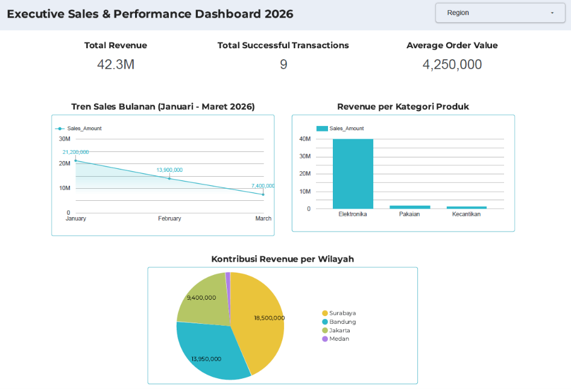

# Executive BI Sales and Performance Dashboard

## Business Problem and Context

TokoKita's executive leadership required an interactive Business Intelligence (BI) dashboard to gain clear visibility into Q1 2026 commercial performance. The platform experienced a continuous revenue contraction across the first three months of the year, dropping from Rp21.2M in January down to Rp7.4M in March.

The objective of this project was to build an executive-ready dashboard in Looker Studio / Power BI. The dashboard needed to track core financial Key Performance Indicators (KPIs), visualize sales velocity across product categories and regions, and provide actionable insights for short-term cash flow recovery and long-term category diversification.

## Dataset Overview

The underlying dataset contains transactional sales logs from January to March 2026, recording customer details, product classifications, order values, regional locations, and payment fulfillment statuses.

* Total Records: 10 core transaction logs (Q1 2026 dataset)
* Primary Columns: Order_ID, Order_Date, Customer_Name, Region, Category, Sales_Amount, Payment_Status
* Core KPIs Analyzed: Total Revenue (SUCCESS status only), Total Successful Transactions, Average Order Value (AOV)

### Data Dictionary

* Order_ID: Unique identifier for each order transaction (e.g., TRX-301)
* Order_Date: Date timestamp of purchase (YYYY-MM-DD)
* Customer_Name: Full name of the customer
* Region: Geographical market location (Jakarta, Bandung, Surabaya, Medan)
* Category: Product classification group (Elektronika, Pakaian, Kecantikan)
* Sales_Amount: Monetary transaction value in IDR
* Payment_Status: Order fulfillment status (SUCCESS, FAILED)

## Methodology and Tools

* Tools Used: Looker Studio / Power BI / Google Sheets
* Visual Hierarchy and Design Principles: Applied the 3-second rule for executive visual scanning and adhered to the 60-30-10 color palette rule to highlight critical performance trends without visual noise.
* Calculated Metrics: Formulated measures for Total Successful Revenue (`SUM` filtered by `Payment_Status = 'SUCCESS'`), Successful Order Volume (`COUNT`), and Average Order Value (`Total Revenue / Total Successful Transactions`).
* Data Visualization Layout: Structured top-level KPI scorecards, a time-series line chart for monthly revenue trends, a horizontal bar chart for category sales, and a regional contribution chart with interactive category/region slicers.

## Key Insights and Metrics

| Metric / Analysis | Result / Value | Business Context |
| :--- | :--- | :--- |
| Total Revenue | Rp42,300,000 | Total gross revenue generated from completed transactions |
| Successful Transactions | 9 orders | Total count of completed purchases |
| Average Order Value (AOV) | Rp4,250,000 | Average monetary spend per successful transaction |
| Top Category | Elektronika (Rp40,000,000) | Generates ~94.5% of total Q1 sales revenue |
| Top Region | Surabaya (Rp18,500,000) | Leading geographical market share, followed by Bandung (Rp13.95M) |

### Key Analytical Findings

1. Q1 Revenue Contraction: Line chart analysis shows a sharp downward revenue trajectory from Rp21,200,000 in January to Rp13,900,000 in February, reaching a low of Rp7,400,000 in March.
2. Product Dependency Risk: Sales are heavily concentrated in Elektronika (Rp40M), while secondary categories such as Pakaian (Rp1.8M) and Kecantikan (Rp500k) contribute minimally to gross revenue.
3. Geographical Market Performance: Surabaya and Bandung represent the highest sales contribution, whereas Medan displays underperformance with low overall volume.

## Business Recommendations

* Short-Term Strategy (Immediate Cash Flow): Launch targeted marketing promotions and featured campaigns for the high-demand Elektronika category to capture immediate high-ticket sales and stabilize cash flow for the upcoming month.
* Mid-to-Long-Term Strategy (Category Balancing): Implement cross-selling bundles and promotional discounts for lower-performing categories (Pakaian and Kecantikan) to elevate secondary category sales volume and reduce reliance on electronics.
* Geographic Expansion and Localization: Scale successful sales playbooks from Surabaya and Bandung into underperforming regions like Medan through localized promotional offers and tailored pricing models.
